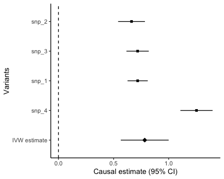

# GWAS-Median-Randomization
Implement GWAS modeling and causal analysis using PLINK and Mendelian Randomization methods.

[[Report]](https://drive.google.com/file/d/1nmbZndjXrh9sRGtSuaGiwhGNufX-FV-D/view?usp=sharing)

# Files Description

## Manhattan_Plot_for_Drink

## MR_Forest_plot
 

# Contact

If you have any question, please feel free to contact the author via [lres50804@gmail.com].
